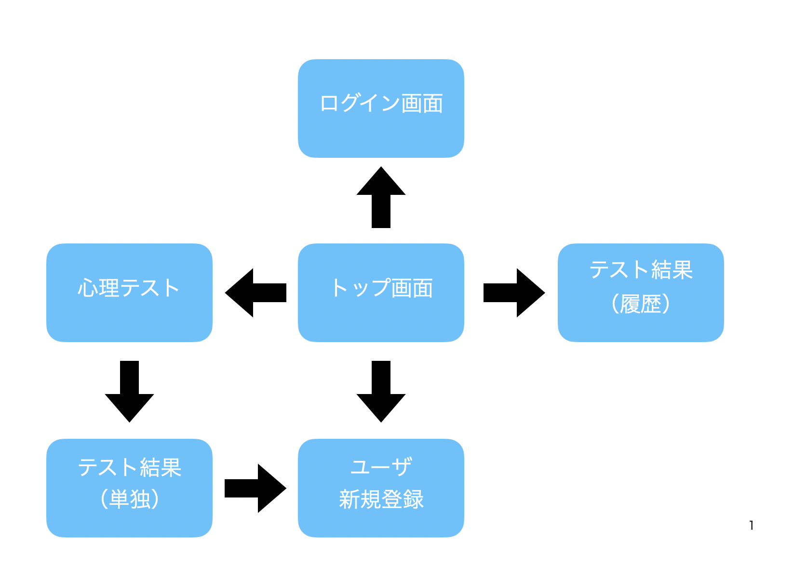
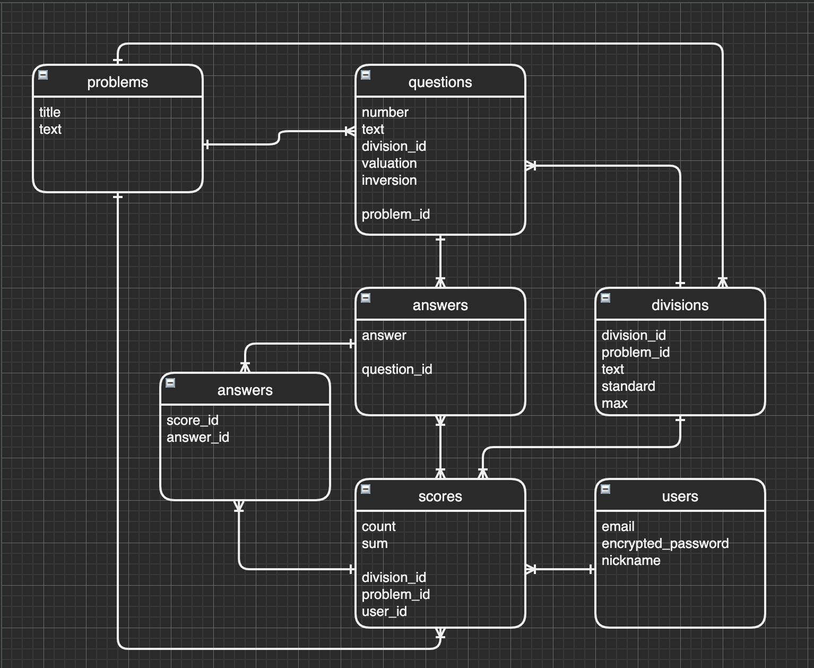

# README

# アプリケーション名
*賢者スケール etc*

# アプリケーション概要
 ①心理テストで、自分の強みを客観的に分析できる。  
 ②レーダーチャと表示で、視覚的に結果を表示する。  
 ③心理テストの履歴情報を確認する事で、自分の成長を実感できる。  
   ※会員情報を登録した場合に限ります。  

# URL
https://psychological-test-app.herokuapp.com

# テスト用アカウント
メールアドレス: sample@sample  
パスワード: sample  

# 利用方法
## 【心理テスト】
1.「トップページ」画面で「診断」ボタンを押下して、「心理テスト」画面へ遷移する。  
2.「心理テスト」画面で★（星）を入力して、「診断スタート」ボタンを押下して、「心理テスト（結果）」画面へ遷移する  
3.「心理テスト（結果）」画面で、レーダーチャートで点数を確認できる。

※ログインしている場合は、診断結果が登録される。

## 【履歴確認】
1.「トップページ」画面で「履歴」ボタンを押下して「心理テスト（比較）」画面へ遷移する。  

※ログインしていて、過去に診断したデータが存在しない場合は、「履歴」ボタンは表示されません  
2.「心理テスト（比較）」画面で、下記の情報を確認できます。  
  【上位】棒グラフで、回数毎の成長記録  
  【下位】レーダーチャートで、回数毎の詳細な情報  

# 目指した課題解決
心理テストには、複雑な計算が難しく、さらに結果も理解しずらいという課題があります。  
そこで、システム側で複雑な計算を行い、結果をグフフで表示する事で、視覚的に結果がわかる心理テストアプリを作りました。  

# 実装した機能
## 【心理テスト】
- ★（星）入力
- レーダーチャート表示
- 強みの判定
- ログイン時のデータ登録
## 【履歴確認】
- 棒グラフ表示
- 前回との比較結果を矢印で表示
- 過去の結果を単独で表示

# 実装予定の機能
## 【心理テスト】
- テスト結果の棒グラフ表示
- 診断後にログアウトの場合の、新規ユーザー登録機能
## 【履歴確認】
- 最新の10件を表示する
- 過去のデータを引き継いで、再診断する機能

# ローカルでの動作方法
$ git clone https://github.com/ikeharanaoya/psychological_test_app.git  
$ cd psychological_test_app  
$ bundle install  
$ rails db:create  
$ rails db:migrate  
$ bundle exec rake db:seed  
$ rails s  
👉 http://localhost:3000  

# 画面遷移図

# ER図

# テーブル設計
## problems テーブル
| Column | Type   | Options     |
|--------|--------|-------------|
| title  | string | null: false |
| text   | text   | null: false |

### Association
- has_many :questions
- has_many :scores

## questions テーブル
| Column      | Type       | Options                       |
|-------------|------------|-------------------------------|
| number      | integer    | null: false                   |
| text        | text       | null: false                   |
| division_id | integer    | null: false                   |
| valuation   | integer    | null: false                   |
| inversion   | boolean    | null: false default: false    |
| problem     | references | null: false foreign_key: true |

### Association
- has_many :answers
- belongs_to :problem
- belongs_to :division

## answers テーブル
| Column   | Type       | Options                       |
|----------|------------|-------------------------------|
| answer   | integer    | null: false                   |
| question | references | null: false foreign_key: true |

### Association
- belongs_to :question
- has_many :scores_answers
- has_many :scores, through: :scores_answers

## scores テーブル
| Column      | Type       | Options                       |
|-------------|------------|-------------------------------|
| count       | integer    | null: false                   |
| sum         | integer    | null: false                   |
| division_id | integer    | null: false                   |
| problem     | references | null: false foreign_key: true |
| user        | references | null: false foreign_key: true |

### Association
- belongs_to :problem
- belongs_to :division
- belongs_to :user
- has_many :scores_answers
- has_many :answers, through: :scores_answers

## scores_answers テーブル
| Column | Type       | Options                       |
|--------|------------|-------------------------------|
| answer | references | null: false foreign_key: true |
| score  | references | null: false foreign_key: true |

### Association

- belongs_to :score
- belongs_to :answer

## divisions テーブル
| Column      | Type       | Options                       |
|-------------|------------|-------------------------------|
| division_id | integer    | null: false                   |
| text        | string     | null: false                   |
| standard    | integer    | null: false                   |
| max         | integer    | null: false                   |
| problem     | references | null: false foreign_key: true |

### Association
- has_many :questions
- has_many :scores

## users テーブル
| Column             | Type   | Options     |
|--------------------|--------|-------------|
| email              | string | null: false |
| encrypted_password | string | null: false |
| nickname           | string | null: false |

### Association
- has_many :scores